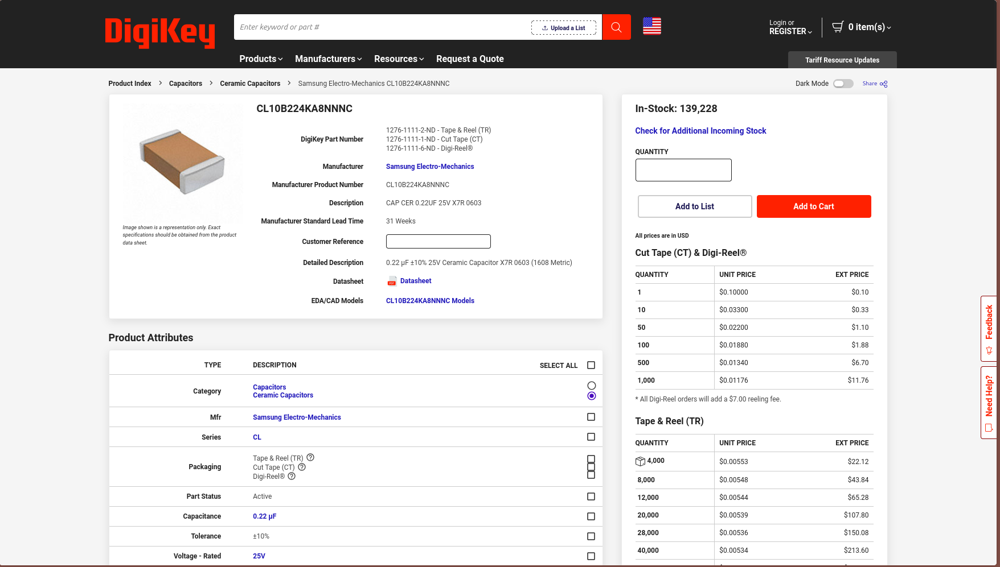

# September 2nd: KiCAD setup and symbols gathering

Following [this guide](https://jams.hackclub.com/jam/hacker-card#Functionality:%20Making%20a%20working%20PCB%20card) by maggie-j-liu on how to design my own PCB business card.
I spent some time on YouTube looking at other people designs but most of the time spent today is setting KiCAD and gathering KiCAD symbols and models through Digikey and Mouser. I will have to finish gathering those files tommorow though because it is getting late.

**Total time spent: 1h 30m**
